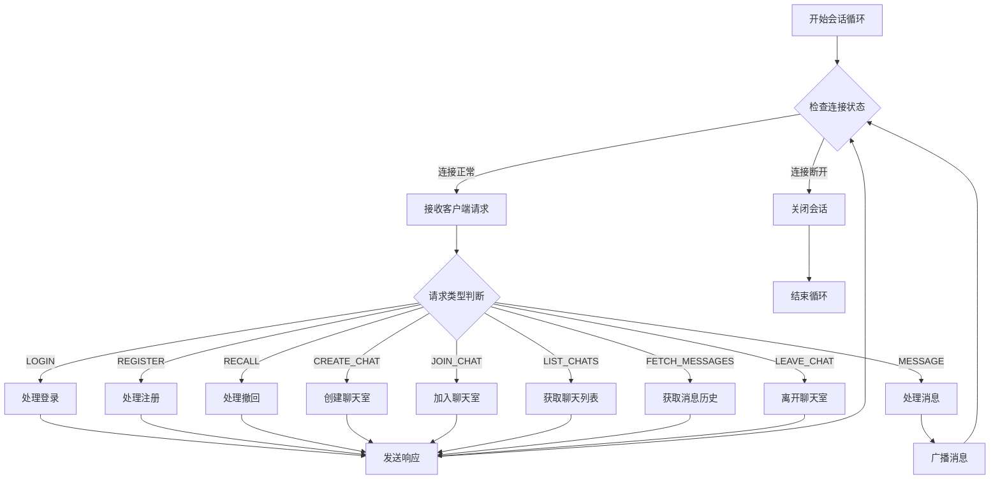
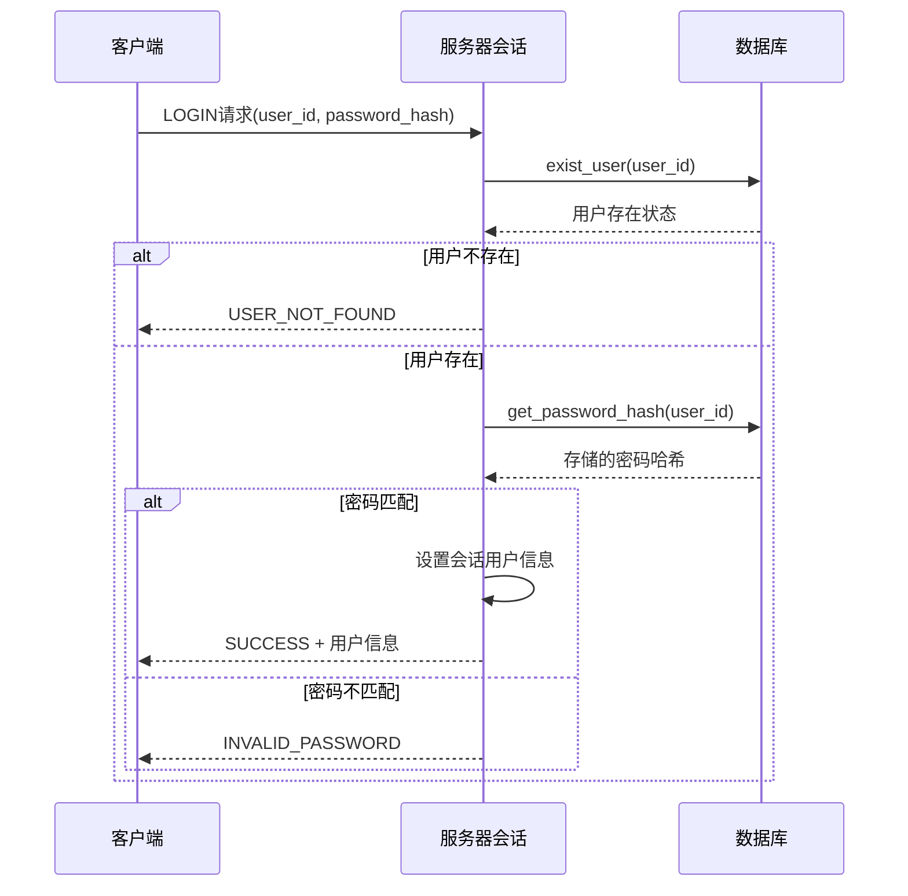

# DuckChat 服务器实现

本文档描述了 DuckChat 服务器的具体实现逻辑和代码结构，基于实际的代码实现。

## 核心架构

### 主要组件
- **主服务器** ([`server.cpp`](../server/server.cpp)): 监听客户端连接，创建会话
- **会话管理器** ([`session_manager.hpp`](../server/session_manager.hpp)): 管理所有客户端会话
- **会话类** ([`session.hpp`](../server/session.hpp)): 处理单个客户端的请求
- **数据库管理器** ([`database.hpp`](../server/database.hpp)): 处理所有数据库操作
- **通信协议** ([`common/protocal.hpp`](../common/protocal.hpp)): 定义数据包格式
- **网络通信** ([`common/network.hpp`](../common/network.hpp)): 处理网络传输

### 线程模型
```
主线程 (监听连接)
├── 会话线程1 (处理客户端1)
├── 会话线程2 (处理客户端2)
├── 会话线程3 (处理客户端3)
└── ...
```

每个客户端连接都会创建一个独立的线程来处理该客户端的所有请求。

## 核心类设计

### 主服务器 (server.cpp)

服务器采用简单的循环监听模式，每个客户端连接创建独立的处理线程：

```cpp
// 核心启动逻辑 - 完整实现见: server/server.cpp:21-46
signal(SIGPIPE, SIG_IGN);
int server_fd = socket(AF_INET, SOCK_STREAM, 0);

sockaddr_in address;
address.sin_family = AF_INET;
address.sin_addr.s_addr = INADDR_ANY;
address.sin_port = htons(5001);  // 监听5001端口

bind(server_fd, (sockaddr *)&address, sizeof(address));
listen(server_fd, 10);

while (true) {
    int client_sock = accept(server_fd, (sockaddr *)&address, (socklen_t *)&addrlen);
    session_manager.create_and_start_session(client_sock);
}
```

> 💡 **设计决策**: 采用"一连接一线程"模型，简化并发处理逻辑，适合中小规模应用。

### SessionManager 类
```cpp
class SessionManager {
private:
    Database database;                                         // 数据库实例
    std::mutex sessions_mutex;                                 // 会话列表互斥锁
    std::unordered_map<int, std::unique_ptr<Session>> sessions; // 会话列表

public:
    SessionManager();
    void create_and_start_session(int socket);
    void close_session(int socket);
    Database* get_database();
    int get_socket_by_user_id(const std::string& user_id);
};
```

**关键方法实现:**

| 方法 | 功能 | 实现位置 |
|------|------|----------|
| `create_and_start_session()` | 创建新会话并启动处理线程 | [`session_manager.cpp:11`](../server/session_manager.cpp:11) |
| `get_database()` | 返回数据库实例指针 | [`session_manager.cpp:35`](../server/session_manager.cpp:35) |
| `get_socket_by_user_id()` | 根据用户ID查找对应的socket | [`session_manager.cpp:40`](../server/session_manager.cpp:40) |
| `close_session()` | 关闭指定会话并清理资源 | [`session_manager.cpp:22`](../server/session_manager.cpp:22) |

> 💡 **线程安全**: 使用 `std::mutex sessions_mutex` 保护会话列表的并发访问。

### Session 类
```cpp
class Session {
private:
    int socket;                    // 客户端socket
    SessionManager* session_manager; // 会话管理器指针

public:
    std::string username;          // 用户名
    std::string user_id;           // 用户ID
    
    Session(int socket, SessionManager* session_manager);
    void handle_session();
    ServerStatus handle_login(const ClientPacket& packet);
    ServerStatus handle_register(const ClientPacket& packet);
    void handle_message(const ClientPacket& packet);
    ServerStatus handle_new_chat(const ClientPacket& packet, const string& uuid);
    ServerStatus handle_join_chat(const ClientPacket& packet);
    ServerStatus handle_recall_message(const ClientPacket& packet);
    ServerStatus handle_leave_chat(const ClientPacket& packet);
};
```

**核心处理逻辑:**

| 方法 | 功能 | 实现位置 |
|------|------|----------|
| `handle_session()` | 主会话处理循环 | [`session.cpp:9`](../server/session.cpp:9) |
| `handle_login()` | 处理用户登录 | [`session.cpp:144`](../server/session.cpp:144) |
| `handle_register()` | 处理用户注册 | [`session.cpp:161`](../server/session.cpp:161) |
| `handle_message()` | 处理消息发送和广播 | [`session.cpp:176`](../server/session.cpp:176) |
| `handle_new_chat()` | 处理创建聊天室 | [`session.cpp:211`](../server/session.cpp:211) |
| `handle_join_chat()` | 处理加入聊天室 | [`session.cpp:222`](../server/session.cpp:222) |
| `handle_recall_message()` | 处理消息撤回 | [`session.cpp:232`](../server/session.cpp:232) |
| `handle_leave_chat()` | 处理离开聊天室 | [`session.cpp:247`](../server/session.cpp:247) |

## 协议处理逻辑

### 客户端协议定义 ([`common/protocal.hpp`](../common/protocal.hpp))

#### ClientMessage 枚举
```cpp
enum class ClientMessage {
    REGISTER,        // 用户注册
    LOGIN,           // 用户登录
    MESSAGE,         // 发送消息
    RECALL,          // 撤回消息
    LIST_CHATS,      // 获取聊天列表
    FETCH_MESSAGES,  // 获取历史消息
    CREATE_CHAT,     // 创建聊天室
    JOIN_CHAT,       // 加入聊天室
    LEAVE_CHAT,      // 离开聊天室
    LOGOUT,          // 用户登出
};
```

#### ClientPacket 结构
```cpp
struct ClientPacket {
    ClientMessage request;
    std::string username;        // 用户名（注册时使用）
    std::string password_hash;   // 密码哈希（登录时使用）
    std::string user_id;          // 用户ID
    std::string chat_id;          // 聊天室ID
    std::string chatname;         // 聊天室名称
    std::string message_id;       // 消息ID
    std::string message;          // 消息内容
};
```

### 服务器协议定义

#### ServerMessage 枚举
```cpp
enum class ServerMessage {
    REGISTER_RESPONSE,   // 注册响应
    LOGIN_RESPONSE,      // 登录响应
    CREATE_CHAT_RESPONSE,// 创建聊天室响应
    JOIN_CHAT_RESPONSE,  // 加入聊天室响应
    RETURN_CHATS,        // 返回聊天列表
    RETURN_MESSAGES      // 返回消息列表
};
```

#### ServerStatus 枚举
```cpp
enum class ServerStatus {
    SUCCESS,           // 操作成功
    USER_NOT_FOUND,    // 用户不存在
    INVALID_PASSWORD,  // 密码错误
    USER_EXISTS,       // 用户已存在
    CHAT_NOT_FOUND,    // 聊天室不存在
    CHAT_EXISTS,       // 聊天室已存在
};
```

### 会话处理流程

#### 主处理循环架构

服务器的会话处理采用事件驱动模式，核心逻辑在 [`session.cpp:9-142`](../server/session.cpp:9)：



#### 核心处理逻辑简化示例

```cpp
// 完整实现见: session.cpp:9-142
void Session::handle_session() {
    while (true) {
        if (!check_online(socket)) {
            session_manager->close_session(socket);
            break;
        }
        ClientPacket packet = recv_client_packet(socket);
        
        // 根据请求类型分发处理 - 详细实现在各handle_*方法中
        switch (packet.request) {
            case ClientMessage::LOGIN: /* 处理登录 */ break;
            case ClientMessage::MESSAGE: /* 处理消息广播 */ break;
            // ... 其他请求类型
        }
    }
}
```

#### 关键业务逻辑

**用户认证流程:**



**登录处理** - [`session.cpp:144-159`](../server/session.cpp:144):
```cpp
Database* db = session_manager->get_database();
if (!db->exist_user(packet.user_id))
    return ServerStatus::USER_NOT_FOUND;

if (packet.password_hash == db->get_password_hash(packet.user_id)) {
    user_id = packet.user_id;
    username = db->get_username(packet.user_id);
    return ServerStatus::SUCCESS;
}
return ServerStatus::INVALID_PASSWORD;
```

**注册处理** - [`session.cpp:161-174`](../server/session.cpp:161):
```cpp
Database* db = session_manager->get_database();
if (db->exist_user(packet.user_id))
    return ServerStatus::USER_EXISTS;

db->add_user(packet.user_id, packet.username, packet.password_hash);
user_id = packet.user_id;
username = packet.username;
return ServerStatus::SUCCESS;
```

> ⚠️ **安全注意**: 当前实现使用SHA256哈希，建议在生产环境中添加盐值(salt)增强安全性。

## 数据库实现

### Database 类结构 ([`database.hpp`](../server/database.hpp))

#### 数据结构定义
```cpp
struct ChatInfo {
    std::string chat_id;
    std::string chatname;
    std::string creator_user_id;
    std::vector<std::string> members; 
};

struct Message {
    std::string message_id;
    std::string user_id;
    std::string content;
    std::string timestamp;
};
```

#### 核心数据库操作

| 分类 | 方法 | 功能 | 实现位置 |
|------|------|------|----------|
| **用户管理** | `exist_user()` | 检查用户是否存在 | [`database.cpp:62`](../server/database.cpp:62) |
| | `add_user()` | 添加新用户 | [`database.cpp:80`](../server/database.cpp:80) |
| | `get_username()` | 获取用户名 | [`database.cpp:99`](../server/database.cpp:99) |
| | `get_password_hash()` | 获取密码哈希 | [`database.cpp:119`](../server/database.cpp:119) |
| **消息管理** | `add_message()` | 添加消息到数据库 | [`database.cpp:139`](../server/database.cpp:139) |
| | `delete_message()` | 删除消息（撤回功能） | [`database.cpp:160`](../server/database.cpp:160) |
| | `fetch_chat_messages()` | 获取聊天室消息历史 | [`database.cpp:236`](../server/database.cpp:236) |
| **聊天室管理** | `chat_exist()` | 检查聊天室是否存在 | [`database.cpp:174`](../server/database.cpp:174) |
| | `get_chatname()` | 获取聊天室名称 | [`database.cpp:192`](../server/database.cpp:192) |
| | `add_chat()` | 创建新聊天室 | [`database.cpp:265`](../server/database.cpp:265) |
| **成员管理** | `list_user_chats()` | 获取用户参与的聊天列表 | [`database.cpp:212`](../server/database.cpp:212) |
| | `get_chat_members()` | 获取聊天室成员列表 | [`database.cpp:284`](../server/database.cpp:284) |
| | `add_chat_member()` | 添加聊天室成员 | [`database.cpp:304`](../server/database.cpp:304) |
| | `leave_chat()` | 用户离开聊天室 | [`database.cpp:323`](../server/database.cpp:323) |

### 数据库初始化 ([`database.cpp:19-53`](../server/database.cpp:19))

#### 表结构
```sql
-- 用户表
CREATE TABLE IF NOT EXISTS users (
    user_id TEXT PRIMARY KEY,
    username TEXT NOT NULL,
    password_hash TEXT NOT NULL
);

-- 聊天室表
CREATE TABLE IF NOT EXISTS chats (
    chat_id TEXT PRIMARY KEY,
    chatname TEXT NOT NULL,
    creator_id TEXT NOT NULL,
    FOREIGN KEY (creator_id) REFERENCES users(user_id)
);

-- 聊天室成员表
CREATE TABLE IF NOT EXISTS chat_members (
    chat_id TEXT,
    user_id TEXT NOT NULL,
    role TEXT DEFAULT 'member',
    FOREIGN KEY (chat_id) REFERENCES chats(chat_id),
    FOREIGN KEY (user_id) REFERENCES users(user_id),
    UNIQUE(chat_id, user_id)
);

-- 消息表
CREATE TABLE IF NOT EXISTS messages (
    message_id TEXT PRIMARY KEY,
    chat_id TEXT NOT NULL,
    sender_id TEXT NOT NULL,
    content TEXT NOT NULL,
    sent_at DATETIME DEFAULT CURRENT_TIMESTAMP,
    FOREIGN KEY (chat_id) REFERENCES chats(chat_id),
    FOREIGN KEY (sender_id) REFERENCES users(user_id)
);
```

## 网络通信

### 网络通信实现

#### 数据包传输机制

网络层采用长度前缀的JSON协议，确保消息完整性：

```cpp
// 核心网络函数 - 完整实现见: common/network.cpp
void send_packet(int socket, const ClientPacket& packet);     // 发送客户端包
void send_packet(int socket, const ServerPacket& packet);     // 发送服务器包
ClientPacket recv_client_packet(int socket);                   // 接收客户端包
ServerPacket recv_server_packet(int socket);                   // 接收服务器包
bool check_online(int socket);                                 // 检查连接状态
```

#### 协议传输格式

```
┌──────────────┬──────────────────────┐
│   4字节长度   │    JSON数据包        │
│  (网络字节序)  │   (UTF-8编码)       │
└──────────────┴──────────────────────┘
```

**发送流程** - [`network.cpp:14-50`](../common/network.cpp:14):
```cpp
// 1. JSON序列化
json serialized = packet;
string json_string = serialized.dump();

// 2. 发送长度前缀
uint32_t length = htonl(json_string.length());
send(socket, &length, sizeof(length), 0);

// 3. 发送JSON数据
send(socket, json_string.c_str(), json_string.length(), 0);
```

**接收流程** - [`network.cpp:52-96`](../common/network.cpp:52):
```cpp
// 1. 接收长度前缀
uint32_t net_length;
recv(socket, &net_length, sizeof(uint32_t), 0);
uint32_t host_length = ntohl(net_length);

// 2. 安全检查
if (host_length > MAX_PACKET_SIZE) return Packet();

// 3. 接收JSON数据并反序列化
string json_string;
json_string.resize(host_length);
recv(socket, &json_string[0], host_length, 0);
return json::parse(json_string).get<Packet>();
```

> 💡 **安全特性**: 实现了最大包大小限制(1MB)防止内存攻击，使用SIGPIPE处理防止进程崩溃。

## 日志系统

### 日志级别和格式

使用统一的日志接口 [`common/log_helper.hpp`](../common/log_helper.hpp)：

```cpp
enum class LogLevel {
    DEBUG,    // 调试信息
    INFO,     // 一般信息
    WARNING,  // 警告信息
    ERROR     // 错误信息
};

// 使用示例
log(LogLevel::INFO, "Client connected: " + client_ip);
log(LogLevel::ERROR, "Database operation failed");
```

### 关键日志记录点

| 位置 | 事件 | 日志级别 |
|------|------|----------|
| [`server.cpp:43`](../server/server.cpp:43) | 客户端连接 | INFO |
| [`session.cpp:34`](../server/session.cpp:34) | 登录失败 | ERROR |
| [`session.cpp:40`](../server/session.cpp:40) | 登录成功 | INFO |
| [`session.cpp:61`](../server/session.cpp:61) | 消息发送 | INFO |
| [`session_manager.cpp:29`](../server/session_manager.cpp:29) | 会话关闭 | INFO |

> 💡 **调试技巧**: 在开发阶段可将日志级别设为DEBUG，生产环境设为INFO以减少日志量。

## 当前实现状态

### ✅ 已实现功能

| 功能模块 | 实现状态 | 关键文件 |
|----------|----------|----------|
| **服务器启动** | ✅ 完成 | [`server.cpp:21-49`](../server/server.cpp:21) |
| **会话管理** | ✅ 完成 | [`session_manager.cpp`](../server/session_manager.cpp) |
| **用户认证** | ✅ 完成 | [`session.cpp:144-174`](../server/session.cpp:144) |
| **消息系统** | ✅ 完成 | [`session.cpp:176-209`](../server/session.cpp:176) |
| **聊天室管理** | ✅ 完成 | [`session.cpp:211-260`](../server/session.cpp:211) |
| **数据库操作** | ✅ 完成 | [`database.cpp`](../server/database.cpp) |
| **网络通信** | ✅ 完成 | [`network.cpp`](../common/network.cpp) |
| **日志系统** | ✅ 完成 | [`log_helper.hpp`](../common/log_helper.hpp) |

### ⏳ 待实现功能

| 功能 | 优先级 | 实现建议 |
|------|--------|----------|
| **心跳机制** | 高 | 定期检测客户端连接状态，自动清理断开连接 |
| **消息加密** | 中 | 使用AES-256-CBC加密敏感消息内容 |
| **文件传输** | 中 | 支持图片、文档等文件类型传输 |
| **在线状态** | 低 | 显示用户在线/离线状态 |
| **群组权限** | 低 | 管理员、成员等角色权限管理 |

### 🔧 关键设计决策

| 决策点 | 选择的方案 | 原因 | 替代方案 |
|--------|------------|------|----------|
| **并发模型** | 一连接一线程 | 实现简单，适合中小规模 | 事件驱动(epoll) |
| **数据库** | SQLite | 轻量级，无需额外部署 | MySQL/PostgreSQL |
| **协议格式** | JSON + 长度前缀 | 易于调试，跨语言兼容 | Protocol Buffers |
| **认证方式** | SHA256哈希 | 实现简单，性能好 | bcrypt/ PBKDF2 |

### 📊 性能特征

| 指标 | 当前表现 | 优化建议 |
|------|----------|----------|
| **并发连接** | 线程数限制 | 使用连接池或事件驱动 |
| **内存使用** | 每连接约1MB | 优化会话数据结构 |
| **消息延迟** | <10ms (局域网) | 异步I/O优化 |
| **数据库查询** | 简单查询<1ms | 添加索引优化 |

## 性能和安全考虑

### 🚀 性能优化策略

| 优化方向 | 当前实现 | 改进建议 |
|----------|----------|----------|
| **并发处理** | 线程模型 | 考虑事件驱动模型(epoll)提升并发能力 |
| **内存管理** | 基础RAII | 实现对象池复用，减少内存分配 |
| **数据库优化** | 基础查询 | 添加索引，实现查询缓存 |
| **网络I/O** | 阻塞模式 | 使用异步I/O提升吞吐量 |

### 🔒 安全措施

| 安全层面 | 当前状态 | 改进建议 |
|----------|----------|----------|
| **密码安全** | SHA256哈希 | 添加盐值，考虑bcrypt或PBKDF2 |
| **输入验证** | 基础检查 | 完善参数验证，防止注入攻击 |
| **传输安全** | 明文传输 | 实现TLS/SSL加密通道 |
| **访问控制** | 基础认证 | 添加权限管理和访问控制 |

### 📈 扩展路线图

#### 短期优化 (1-2个月)
1. **心跳机制** - 自动检测断开连接
2. **消息加密** - 端到端加密保护隐私
3. **性能监控** - 添加关键指标监控

#### 中期扩展 (3-6个月)
1. **集群部署** - 支持多服务器负载均衡
2. **缓存系统** - Redis缓存热点数据
3. **文件传输** - 支持多媒体文件分享

#### 长期规划 (6个月+)
1. **微服务架构** - 拆分为独立的微服务
2. **消息队列** - 使用RabbitMQ/Kafka处理高并发
3. **AI集成** - 智能消息处理和推荐