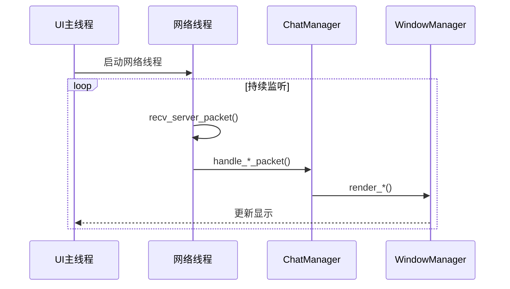

# DuckChat 客户端实现

本文档描述了 DuckChat 客户端的具体实现逻辑和代码结构，基于实际的代码实现。

## 核心架构

### 主要组件
- **主客户端** ([`client.cpp`](../client/client.cpp)): 程序入口和主循环
- **窗口管理器** ([`window_manager.hpp`](../client/window_manager.hpp)): 管理用户界面和窗口显示
- **聊天管理器** ([`chat_manager.hpp`](../client/chat_manager.hpp)): 处理聊天逻辑和网络通信
- **通信协议** ([`common/protocal.hpp`](../common/protocal.hpp)): 定义数据包格式
- **网络通信** ([`common/network.hpp`](../common/network.hpp)): 处理网络传输

### 线程模型
```
主线程 (UI渲染和输入处理)
├── 网络线程 (消息收发)
├── 消息处理线程 (协议解析)
└── UI更新线程 (界面刷新)
```

## 核心类设计

### 主客户端 (client.cpp)

客户端采用多线程架构，主线程负责UI交互，后台线程处理网络通信：

```cpp
// 核心启动流程 - 完整实现见: client/client.cpp:32-141
int main() {
    // 1. 网络连接建立
    server_fd = socket(AF_INET, SOCK_STREAM, 0);
    // ... 连接服务器逻辑
    
    // 2. 用户认证 (注册/登录)
    // ... 认证流程
    
    // 3. 启动网络接收线程
    thread client_thread_receive(handle_server_receive);
    client_thread_receive.detach();
    
    // 4. 初始化UI和聊天管理器
    chat_manager = ChatManager(server_fd, &window_manager, user_id, username);
    chat_manager.initiate();
    window_manager.initiate();
    
    // 5. 启动UI主循环
    window_manager.handle_input();
}
```

> 💡 **设计决策**: 分离UI线程和网络线程，避免网络阻塞影响用户体验。

### WindowManager 类
```cpp
class WindowManager {
private:
    // ncurses 窗口句柄
    WINDOW* main_window;
    WINDOW* chat_window;
    WINDOW* input_window;
    WINDOW* status_window;
    
    // 窗口尺寸
    int main_height, main_width;
    int chat_height, chat_width;
    int input_height, input_width;
    
    // UI状态
    bool running;
    int current_chat_index;
    
public:
    // 核心方法
    void initiate();                    // 初始化UI系统
    void handle_input();                 // 主输入循环
    void refresh_windows();              // 刷新所有窗口
    
    // 渲染方法
    void render_chat_history(const std::vector<Message>& messages);
    void render_chats(const std::vector<ChatInfo>& chats);
    void show_status(const std::string& message, bool is_error = false);
    
    // 交互控制
    void scroll_messages(int direction);
    void scroll_chats(int direction);
    void switch_active_window();
    std::string get_input();
};
```

> 💡 **UI框架**: 基于ncursesw实现终端UI，支持UTF-8中文显示和颜色主题。

### ChatManager 类
```cpp
class ChatManager {
private:
    int server_sock;
    Chat current_chat;
    std::vector<ChatInfo> chat_list;
    std::string current_chat_id;
    WindowManager *window_manager;
    std::string current_user_id;
    std::string current_username;

public:
    ChatManager(int server_sock, WindowManager *window_manager,
                std::string user_id, std::string username);
    
    // 核心方法
    void initiate();                                    // 初始化聊天管理器
    
    // 服务器响应处理
    void handle_chat_lists(const ServerPacket &packet);     // 处理聊天列表
    void handle_chat_history(const ServerPacket &packet);   // 处理消息历史
    void handle_new_message(const ServerPacket &packet);    // 处理新消息
    void handle_new_chat(const ServerPacket &packet);       // 处理新聊天室
    
    // 聊天操作
    void create_chat(const std::string &chatname);          // 创建聊天室
    void join_chat(const std::string &chat_id);             // 加入聊天室
    void leave_chat(const std::string &chat_id);            // 离开聊天室
    void add_message(const std::string &message);           // 发送消息
    void recall_message(const std::string &message_id);      // 撤回消息
    
    // 数据获取
    std::vector<Message> get_current_chat_messages();       // 获取当前聊天消息
    std::vector<ChatInfo> get_chat_list();                  // 获取聊天列表
};
```

> 💡 **状态管理**: 维护当前聊天状态，自动同步服务器数据到本地UI。

## 用户界面设计

### 窗口布局
```
┌─────────────────────────────────────────────────────────────┐
│ DuckChat - 用户名                    [状态] [时间]          │ 标题栏
├─────────────┬───────────────────────────────────────────────┤
│ 聊天列表     │ 聊天消息区域                                  │
│ ✓ 聊天室1    │ [用户1] 12:30: Hello World!                  │
│ ✓ 聊天室2    │ [用户2] 12:31: Hi there!                     │
│   聊天室3    │ [用户1] 12:32: How are you?                  │
│   聊天室4    │                                               │
│   聊天室5    │                                               │
│             │                                               │
├─────────────┴───────────────────────────────────────────────┤
│ > 输入消息内容...                                          │ 输入栏
└─────────────────────────────────────────────────────────────┘
```

### 窗口功能
1. **标题栏**: 显示应用名称、当前用户、连接状态和时间
2. **聊天列表**: 显示用户参与的所有聊天室，支持选择切换
3. **消息区域**: 显示当前聊天室的消息历史，支持滚动查看
4. **输入栏**: 用户输入消息的地方，支持多行输入

## 协议处理逻辑

### 客户端请求处理

#### 聊天管理器初始化

```cpp
// 完整实现见: chat_manager.cpp:31-44
void ChatManager::initiate() {
    // 请求用户的聊天列表
    ClientPacket chats_request;
    chats_request.request = ClientMessage::LIST_CHATS;
    chats_request.user_id = current_user_id;
    send_packet(server_sock, chats_request);

    // 处理服务器响应并更新UI
    ServerPacket chats_packet = recv_server_packet(server_sock);
    handle_chat_lists(chats_packet);
}
```

#### 核心操作流程

| 操作 | 实现位置 | 关键步骤 |
|------|----------|----------|
| **发送消息** | [`chat_manager.cpp:58`](../client/chat_manager.cpp:58) | 生成本地消息ID → 发送服务器 → 立即显示本地 |
| **创建聊天室** | [`chat_manager.cpp:129`](../client/chat_manager.cpp:129) | 发送创建请求 → 等待服务器响应 → 更新聊天列表 |
| **加入聊天室** | [`chat_manager.cpp:164`](../client/chat_manager.cpp:164) | 发送加入请求 → 获取聊天历史 → 切换当前聊天 |
| **撤回消息** | [`chat_manager.cpp:152`](../client/chat_manager.cpp:152) | 发送撤回请求 → 服务器广播 → 更新本地显示 |

#### 消息发送示例

```cpp
// 简化版消息发送 - 完整实现见: chat_manager.cpp:58-76
void ChatManager::add_message(const std::string &message) {
    ClientPacket packet;
    packet.request = ClientMessage::MESSAGE;
    packet.user_id = current_user_id;
    packet.chat_id = current_chat_id;
    packet.message = message;
    packet.message_id = Utils::get_uuid();  // 生成唯一消息ID

    send_packet(server_sock, packet);
    
    // 立即显示本地消息，提供即时反馈
    Message new_message(packet, Utils::get_iso_timestamp());
    current_chat.add_message(new_message);
    window_manager->render_chat_history(current_chat.get_messages());
}
```

> 💡 **用户体验**: 采用"乐观UI"策略，发送消息后立即显示，无需等待服务器确认。

### 服务器响应处理

#### 网络接收循环

客户端使用独立线程处理服务器响应，确保UI响应性：



#### 响应分发逻辑 - [`client.cpp:163-192`](../client/client.cpp:163)

```cpp
void handle_server_receive() {
    while (true) {
        ServerPacket packet = recv_server_packet(server_fd);

        switch (packet.request) {
        case ServerMessage::NEW_MESSAGE:
            chat_manager.handle_new_message(packet);
            break;
        case ServerMessage::RETURN_CHATS:
            chat_manager.handle_chat_lists(packet);
            break;
        case ServerMessage::RETURN_MESSAGES:
            chat_manager.handle_chat_history(packet);
            break;
        case ServerMessage::JOIN_CHAT_RESPONSE:
        case ServerMessage::CREATE_CHAT_RESPONSE:
            chat_manager.handle_new_chat(packet);
            break;
        }
    }
}
```

> ⚠️ **线程安全**: UI更新操作在主线程执行，网络线程仅负责数据接收和解析。

#### 服务器响应处理实现

| 响应类型 | 处理方法 | 实现位置 | 主要逻辑 |
|----------|----------|----------|----------|
| **聊天列表** | `handle_chat_lists()` | [`chat_manager.cpp:46`](../client/chat_manager.cpp:46) | 更新本地聊天列表并渲染UI |
| **消息历史** | `handle_chat_history()` | [`chat_manager.cpp:52`](../client/chat_manager.cpp:52) | 加载聊天历史并显示 |
| **新消息** | `handle_new_message()` | [`chat_manager.cpp:78`](../client/chat_manager.cpp:78) | 添加到当前聊天并更新UI |
| **新聊天室** | `handle_new_chat()` | [`chat_manager.cpp:106`](../client/chat_manager.cpp:106) | 加入聊天列表并获取历史 |

**新消息处理示例** - [`chat_manager.cpp:78`](../client/chat_manager.cpp:78):
```cpp
void ChatManager::handle_new_message(const ServerPacket &packet) {
    if (packet.status == ServerStatus::SUCCESS && !packet.messages.empty()) {
        Message message = packet.messages[0];
        
        // 只处理当前聊天室的消息
        if (packet.chats.empty() || packet.chats[0].chat_id != current_chat_id) {
            return;
        }
        
        current_chat.add_message(message);
        window_manager->render_chat_history(current_chat.get_messages());
    }
}
```

**新聊天室处理示例** - [`chat_manager.cpp:106`](../client/chat_manager.cpp:106):
```cpp
void ChatManager::handle_new_chat(const ServerPacket &packet) {
    if (packet.chats.empty()) return;
    
    chat_list.push_back(packet.chats[0]);
    current_chat_id = packet.chats[0].chat_id;
    window_manager->render_chats(chat_list);
    
    // 自动获取聊天历史
    ClientPacket request_packet;
    request_packet.request = ClientMessage::FETCH_MESSAGES;
    request_packet.chat_id = current_chat_id;
    send_packet(server_sock, request_packet);
}
```

> 💡 **自动同步**: 加入聊天室后自动获取消息历史，确保数据完整性。

## 窗口管理实现

### UI架构设计

客户端采用类vim的分割窗口布局，基于ncursesw实现：

```
┌─────────────────────────────────────────────────────────────┐
│ DuckChat - 用户名                    [状态] [时间]          │ 状态栏
├─────────────┬───────────────────────────────────────────────┤
│ 聊天列表     │ 聊天消息区域                                  │
│ ✓ 聊天室1    │ [用户1] 12:30: Hello World!                  │
│ ✓ 聊天室2    │ [用户2] 12:31: Hi there!                     │
│   聊天室3    │ [用户1] 12:32: How are you?                  │
│             │                                               │ 主内容区
├─────────────┴───────────────────────────────────────────────┤
│ > 输入消息内容...                                          │ 输入栏
└─────────────────────────────────────────────────────────────┘
```

### 初始化和布局 - [`window_manager.cpp:13-87`](../client/window_manager.cpp:13)

```cpp
void WindowManager::initiate() {
    // 1. 初始化ncursesw环境
    setlocale(LC_ALL, "zh_CN.UTF-8");  // 支持中文
    initscr();
    cbreak();
    noecho();
    keypad(stdscr, TRUE);
    start_color();
    
    // 2. 定义颜色主题
    init_pair(1, COLOR_RED, COLOR_BLACK);    // 错误信息
    init_pair(2, COLOR_GREEN, COLOR_BLACK);  // 成功信息
    init_pair(3, COLOR_CYAN, COLOR_BLACK);   // 状态信息
    init_pair(4, COLOR_WHITE, COLOR_BLUE);   // 活动窗口高亮
    
    // 3. 创建分割窗口
    int scr_line, scr_col;
    getmaxyx(stdscr, scr_line, scr_col);
    
    chat_list_window = newwin(scr_line - 2, scr_col / 4, 0, 0);
    message_window = newwin(scr_line - 2, scr_col - scr_col / 4, 0, scr_col / 4);
    status_window = newwin(1, scr_col, scr_line - 2, 0);
    input_window = newwin(1, scr_col, scr_line - 1, 0);
}
```

### 输入处理机制 - [`window_manager.cpp:89-206`](../client/window_manager.cpp:89)

客户端采用命令模式的交互设计：

| 按键 | 功能 | 实现位置 |
|------|------|----------|
| `m` | 进入消息发送模式 | [`window_manager.cpp:101`](../client/window_manager.cpp:101) |
| `:` | 进入命令模式 | [`window_manager.cpp:113`](../client/window_manager.cpp:113) |
| `TAB` | 切换活动窗口 | [`window_manager.cpp:160`](../client/window_manager.cpp:160) |
| `↑/↓` | 滚动消息/聊天列表 | [`window_manager.cpp:163`](../client/window_manager.cpp:163) |
| `←/→` | 切换窗口模式 | [`window_manager.cpp:177`](../client/window_manager.cpp:177) |
| `q` | 退出程序 | [`window_manager.cpp:96`](../client/window_manager.cpp:96) |

**命令模式支持**:
- `:cc <名称>` - 创建聊天室
- `:jc <ID>` - 加入聊天室
- `:lc <ID>` - 离开聊天室
- `:help` - 显示帮助

### 渲染系统

| 渲染方法 | 功能 | 实现位置 |
|----------|------|----------|
| `render_chat_history()` | 渲染消息历史 | [`window_manager.cpp:279`](../client/window_manager.cpp:279) |
| `render_chats()` | 渲染聊天列表 | [`window_manager.cpp:380`](../client/window_manager.cpp:380) |
| `show_status()` | 显示状态信息 | [`window_manager.cpp:479`](../client/window_manager.cpp:479) |

> 💡 **用户体验**: 支持UTF-8中文显示，颜色主题区分不同类型信息，滚动查看历史记录。

## 安全特性

### 当前安全实现

| 安全特性 | 实现状态 | 说明 |
|----------|----------|------|
| **密码哈希** | ✅ 已实现 | 使用SHA256哈希存储密码 - [`client.cpp:143`](../client/client.cpp:143) |
| **消息加密** | ⏳ 计划中 | 预留加密接口，待实现AES-256-CBC |
| **输入验证** | ✅ 部分实现 | 基本的消息长度和格式检查 |
| **连接验证** | ✅ 已实现 | 使用`check_online()`检测连接状态 |

### 密码哈希实现

```cpp
// SHA256密码哈希 - 完整实现见: client.cpp:143-161
string sha256(const std::string &str) {
    EVP_MD_CTX *mdctx = EVP_MD_CTX_new();
    const EVP_MD *md = EVP_sha256();
    unsigned char hash[EVP_MAX_MD_SIZE];
    unsigned int hash_len;

    EVP_DigestInit_ex(mdctx, md, NULL);
    EVP_DigestUpdate(mdctx, str.c_str(), str.length());
    EVP_DigestFinal_ex(mdctx, hash, &hash_len);
    EVP_MD_CTX_free(mdctx);

    std::stringstream ss;
    for (unsigned int i = 0; i < hash_len; i++) {
        ss << hex << setw(2) << setfill('0') << (int)hash[i];
    }
    return ss.str();
}
```

### 计划中的加密功能

```cpp
// 预留的消息加密接口 (待实现)
class MessageEncryption {
private:
    std::string encryption_key;
    
public:
    std::string encrypt(const std::string& plaintext);
    std::string decrypt(const std::string& ciphertext);
    
private:
    std::string aes_encrypt(const std::string& data, const std::string& key);
    std::string aes_decrypt(const std::string& data, const std::string& key);
};
```

> ⚠️ **安全建议**: 当前SHA256实现未加盐，生产环境建议使用bcrypt或PBKDF2增强安全性。

## 当前实现状态

### ✅ 已实现功能

| 功能模块 | 实现状态 | 关键文件 |
|----------|----------|----------|
| **UI框架** | ✅ 完成 | [`window_manager.cpp`](../client/window_manager.cpp) |
| **网络通信** | ✅ 完成 | [`network.cpp`](../common/network.cpp) |
| **用户认证** | ✅ 完成 | [`client.cpp:54-116`](../client/client.cpp:54) |
| **聊天管理** | ✅ 完成 | [`chat_manager.cpp`](../client/chat_manager.cpp) |
| **消息系统** | ✅ 完成 | [`chat_manager.cpp:58-76`](../client/chat_manager.cpp:58) |
| **UI交互** | ✅ 完成 | [`window_manager.cpp:89-206`](../client/window_manager.cpp:89) |
| **多线程** | ✅ 完成 | [`client.cpp:133-134`](../client/client.cpp:133) |

### ⏳ 待实现功能

| 功能 | 优先级 | 实现建议 |
|------|--------|----------|
| **消息加密** | 高 | 集成OpenSSL实现端到端加密 |
| **文件传输** | 中 | 支持图片、文档等文件类型 |
| **表情支持** | 中 | 集成emoji表情和自定义表情 |
| **通知系统** | 中 | 桌面通知和声音提醒 |
| **主题系统** | 低 | 多种颜色主题和自定义主题 |
| **配置管理** | 低 | 用户配置文件和设置界面 |

### 🔧 关键设计决策

| 决策点 | 选择的方案 | 原因 | 替代方案 |
|--------|------------|------|----------|
| **UI框架** | ncursesw | 跨平台终端UI，支持中文 | Qt/GTK图形界面 |
| **线程模型** | UI+网络双线程 | 简单可靠，避免阻塞 | 单线程异步I/O |
| **消息同步** | 乐观UI | 即时反馈，用户体验好 | 严格服务器确认 |
| **输入模式** | 命令模式 | 高效，类似vim操作 | 图形化按钮操作 |

### 📊 用户体验特征

| 特性 | 当前表现 | 改进建议 |
|------|----------|----------|
| **响应速度** | <50ms本地响应 | 优化渲染算法 |
| **内存使用** | 基础消息缓存 | 实现消息分页 |
| **网络延迟** | <100ms局域网 | 添加消息重试机制 |
| **易用性** | 命令行操作 | 添加快捷键提示 |

## 性能优化建议

### 🎨 UI渲染优化

| 优化方向 | 当前实现 | 改进方案 |
|----------|----------|----------|
| **渲染策略** | 全量重绘 | 增量更新，只刷新变化区域 |
| **消息显示** | 全部加载 | 虚拟滚动，按需渲染可见消息 |
| **内存管理** | 基础缓存 | LRU缓存，限制内存使用 |
| **响应性能** | 即时渲染 | 异步渲染，避免UI阻塞 |

### 🌐 网络优化

| 优化方向 | 当前实现 | 改进方案 |
|----------|----------|----------|
| **连接管理** | 基础重连 | 指数退避重连，连接池 |
| **消息传输** | 即时发送 | 批量发送，压缩传输 |
| **状态同步** | 轮询更新 | 推送通知，增量同步 |
| **错误处理** | 基础处理 | 完善重试机制和降级策略 |

### 💾 内存优化

| 优化方向 | 当前实现 | 改进方案 |
|----------|----------|----------|
| **对象管理** | 直接创建 | 对象池复用，减少分配 |
| **消息历史** | 全部保存 | 分页加载，定期清理 |
| **智能指针** | 手动管理 | RAII，自动资源管理 |
| **内存监控** | 无监控 | 添加内存使用统计 |

## 扩展功能建议

### 🎯 短期扩展 (1-2个月)

1. **消息加密** - 端到端加密保护隐私
2. **文件传输** - 支持图片、文档分享
3. **表情系统** - emoji和自定义表情
4. **通知提醒** - 桌面通知和声音提醒

### 🚀 中期扩展 (3-6个月)

1. **主题系统** - 多种颜色主题和自定义
2. **搜索功能** - 全文搜索消息和聊天记录
3. **快捷回复** - 预设回复模板
4. **配置管理** - 用户设置和偏好管理

### 🌟 长期规划 (6个月+)

1. **插件系统** - 支持第三方插件扩展
2. **多语言支持** - 国际化和本地化
3. **语音消息** - 语音录制和播放
4. **消息状态** - 已读/未读状态显示